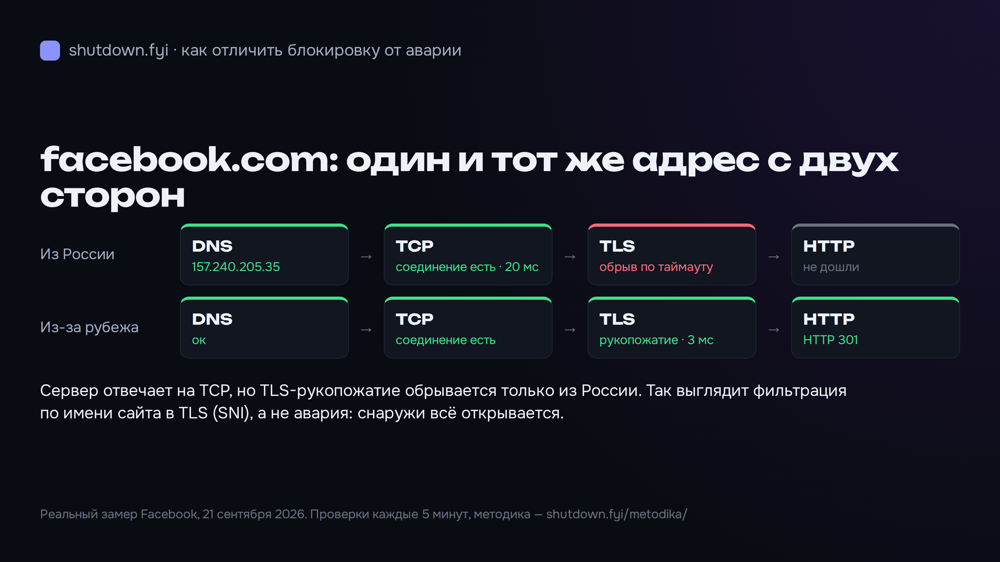
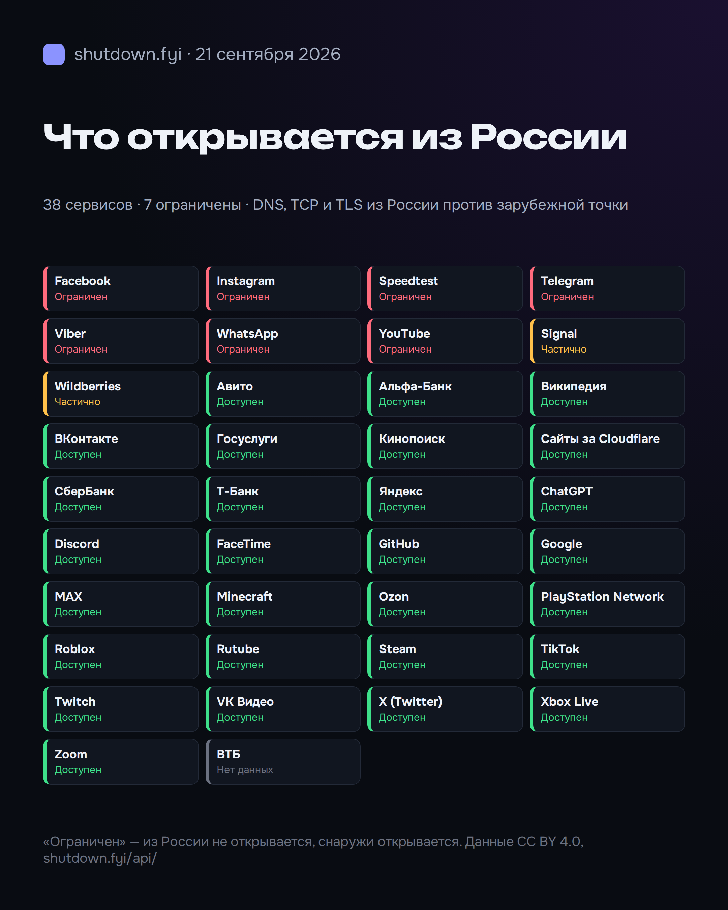

# shutdown.fyi — открытые данные о сбоях и ограничениях интернета в России

[shutdown.fyi](https://shutdown.fyi/?utm_source=github&utm_medium=referral&utm_campaign=open_repo) показывает, что не работает в России прямо сейчас: 38 сервисов, 8 операторов, 85 регионов. Сайт отвечает на два разных вопроса:

- **открывается ли сервис из России вообще** — активные проверки DNS → TCP → TLS → HTTP каждые 5 минут из российской и из зарубежной точки;
- **стало ли хуже, чем обычно** — жалобы с сайта и восьми внешних детекторов, измерения OONI, трафик сетей (IODA), сравнение с нормой того же часа.

Этот репозиторий — документация открытого API, код виджета, примеры и методика. Данные — **CC BY 4.0**, со ссылкой на shutdown.fyi. Ключ не нужен.



## Быстрый старт

```bash
curl -s https://shutdown.fyi/api/status.json | jq '.items[] | select(.status != "ok") | {name, status, reports1h}'
```

```bash
# Один сервис: статус, жалобы по источникам, проверки доступа из России и из-за рубежа
curl -s https://shutdown.fyi/api/status/service/youtube.json | jq '.probe'
```

Примеры на Python и JavaScript — в [`examples/`](examples/).

## Эндпоинты

| URL | Что отдаёт |
|---|---|
| `/api/status.json` | Все сущности: статус, индекс, жалобы за час и сутки. Кэш 60 с |
| `/api/status/{kind}/{slug}.json` | Одна сущность: история по часам за 24 ч, жалобы по источникам, проверки доступа |
| `/api/incidents.json` | Инциденты за 7 дней: начало, конец, сущность, серьёзность |
| `/rss.xml` | Сводки дня и заметки об инцидентах |

`kind`: `service`, `operator`, `region`. Подробно, с полями ответа — [docs/api.md](docs/api.md).

## Виджет

Карточка статуса, обновляется сама, светлая и тёмная тема, без сторонних скриптов:

```html
<iframe src="https://shutdown.fyi/widget/telegram/" width="100%" height="120"
        style="border:0;max-width:420px" loading="lazy" title="Статус Telegram — shutdown.fyi"></iframe>
```

`/widget/{slug}/` — сервисы и операторы, `/widget/region/{slug}/` — регионы.

## Что открывается из России сейчас



«Ограничен» — адрес не открывается из России, но открывается из зарубежной точки. Если не открывается ни оттуда, ни оттуда, это «недоступен», то есть авария у самого сервиса. Для отечественных сервисов из белых списков обрыв только с нашей российской точки считается «нет вывода»: банки режут хостинговые адреса антиботом, и называть это ограничением было бы неправдой.

## Методика

Коротко: у каждой сущности две независимые оси — **доступ** (по активным проверкам) и **инцидент** (изменение относительно нормы того же часа). Полностью — [docs/methodology.md](docs/methodology.md) и [shutdown.fyi/metodika/](https://shutdown.fyi/metodika/?utm_source=github&utm_medium=referral&utm_campaign=open_repo).

## Условия

- до 60 запросов в минуту с адреса; цифры обновляются раз в несколько минут, чаще опрашивать бессмысленно;
- при публикации — ссылка на shutdown.fyi;
- код примеров в этом репозитории — MIT.

Нашли ошибку в данных или хотите новый сервис или регион — [issue](../../issues).

---

## English

[shutdown.fyi](https://shutdown.fyi/?utm_source=github&utm_medium=referral&utm_campaign=open_repo) tracks internet outages and access restrictions in Russia: 38 services, 8 carriers, 85 regions. Every 5 minutes it probes each service (DNS → TCP → TLS → HTTP) from a vantage point inside Russia and from one abroad. If it only fails from inside, it's a restriction, not an outage. It also compares complaints from the site and eight public outage detectors, OONI measurements and IODA traffic against the usual level for that hour.

The JSON API needs no key. Data is CC BY 4.0 with attribution. See [docs/api.md](docs/api.md) and [examples/](examples/).
